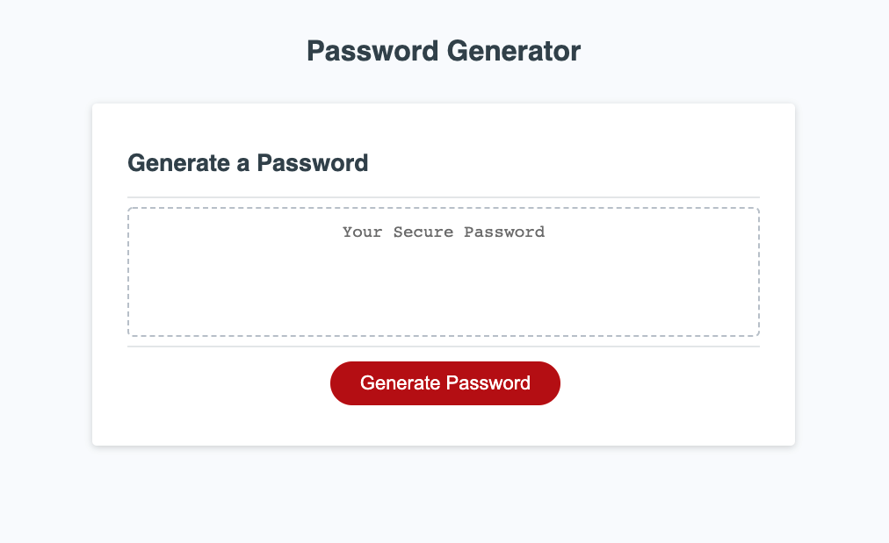

# Password-Generator

## Description

I added functionality to an application that enables employees to generate random passwords based on criteria that they’ve selected. This app uses HTML, CSS and JavaScript to dynamically render the password to the screen. The user has options to include special characters, uppercase letters, lowercase letters, and numerical values.

## Technologies Used

```
HTML
CSS
JavaScript

```

# GitHub Pages:
https://clogerie92.github.io/Password-Generator/

## Mock-Up

The following image shows the web application's appearance:




## Contributer
Carl Logerie
Contact: carl.logerie92@gmail.com